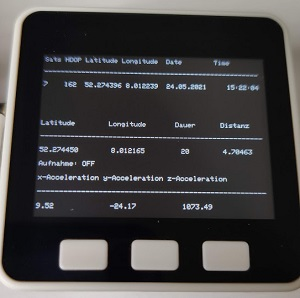

 ### IOT_RoadConditionMonitoring
 
 #### M5Stack
 
 
 #### Mit InfluxDB
 
 
 #### genutzte Sensoren:
 <a href="https://shop.m5stack.com/products/gps-module?variant=16804773003354">GPS Modul</a>
 In M5Stack verbaute Beschleunigungssensor.
 
